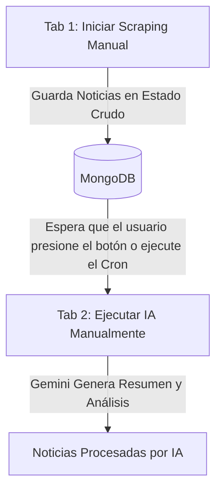

# Politech - Developer Guide & Bitácora de Integración

Este documento sirve como bitácora y guía técnica de los avances realizados en la arquitectura, integración de base de datos, pipeline de IA, y robustez de pruebas del proyecto Politech.

---

## 1. Arquitectura Unificada y Modelo de Base de Datos

* **Consolidación de Modelos:**
  * Eliminamos el modelo redundante `Candidate.js` y unificamos toda la estructura en `Candidato.js` en el backend.
  * El modelo [Candidato.js](file:///home/o1101ol/Repositorios/Politech/backend/models/Candidato.js) ahora almacena tanto la información estática del candidato (`nombre`, `partidoPolitico`, `antecedentesJudiciales`) como el historial de noticias procesadas y analizadas (`historial_noticias` de tipo `noticiaSchema`).
  * Agregamos un valor por defecto (`'Desconocido'`) en `partidoPolitico` para prevenir fallas al crear candidatos si el formulario no envía este campo.

* **Unificación de Rutas API:**
  * Todas las rutas se movieron a [routes/candidato.routes.js](file:///home/o1101ol/Repositorios/Politech/backend/routes/candidato.routes.js).
  * En [app.js](file:///home/o1101ol/Repositorios/Politech/backend/app.js), registramos la API principal en `/api/candidatos`.
  * **Compatibilidad heredada (Alias):** Agregamos un alias para mapear `/api/candidates` al mismo router. Esto permite que el frontend (`dashboard.html`), que hace consultas a `/api/candidates`, funcione al 100% sin tener que reescribir sus llamadas fetch.

---

## 2. Flujo del Pipeline (Scraping ➔ IA)

El procesamiento está dividido en dos etapas bien diferenciadas para evitar tiempos de espera largos para el usuario:



### Comportamiento del Modo Mock (`MOCK_MODE`)

Existe un detalle clave en cómo interactúan el modo simulado (Mock) y el modo real:
1. Por defecto, el servidor lee `MOCK_MODE=true` de tu archivo `.env`.
2. **Vinculación dinámica en vivo:** Cuando disparas un scraping manual desde la Pestaña 1, el backend intercepta el valor del checkbox *"Usar Modo Mock (Simulado)"* y sobreescribe la variable global del proceso de Node:
   ```javascript
   process.env.MOCK_MODE = mockMode ? 'true' : 'false';
   ```
   * Si marcas la simulación en el Scraper, el posterior procesamiento de la IA (Pestaña 2) también usará el **Mock**.
   * Si desmarcas la simulación, el servidor pondrá la variable en `false` globalmente e **intentará llamar a la API real de Gemini** (requiere `GEMINI_API_KEY` válida).

---

## 3. Resoluciones de Errores Críticos (Bugs Solucionados)

* **Orden de Middleware de CORS (Backend):**
  * *Error:* El navegador bloqueaba las llamadas fetch debido a políticas de CORS (`Access-Control-Allow-Origin` faltante).
  * *Causa:* Las rutas de candidatos estaban declaradas antes que el middleware de CORS en `app.js`.
  * *Solución:* Reordenamos los middlewares en `app.js` para asegurar que el bloque de CORS se registre al principio, permitiendo que cualquier llamada retorne los headers correctos.

* **ReferenceError en Creación de Candidato (Frontend):**
  * *Error:* La creación de un nuevo candidato fallaba en la consola del navegador con un error `ReferenceError: candidateName is not defined`.
  * *Causa:* El callback de respuesta del formulario de creación intentaba refrescar una grilla usando una variable `candidateName` copiada erróneamente del formulario del scraper.
  * *Solución:* Limpiamos el bloque redundante en `dashboard.html`. La recarga de listas desplegables y grillas ahora se maneja de forma segura usando `loadCandidates()`.

* **Mejora de UX (Pestaña de Analíticas):**
  * *Mejora:* Agregamos reactividad al subtítulo de la pestaña de IA. Ahora cambia dinámicamente de `(Selecciona un candidato en la Pestaña 1)` a `Candidato actual: [Nombre]` cuando seleccionas un candidato en la vista de noticias.

---

## 4. Estrategia de Cobertura de Tests (≥85%)

Incrementamos la cobertura de tests del backend de **40% a 85.45%** (y cobertura de líneas al **86.28%**) con pruebas 100% simuladas (mocks) que no consumen cuota de la API de Gemini ni tocan bases de datos de producción.

* **Mocks de Tiempo (`sleep`):** 
  * En `scraperService.test.js`, interceptamos la función `setTimeout` global durante los tests para ejecutar sus callbacks instantáneamente. Esto permite probar los bucles del scraper con delays aleatorios en 0 milisegundos reales, evitando el error de timeout de Jest de 5 segundos.
* **Mocks de JSDOM para XML:**
  * Creamos un mock específico para `jsdom` en las pruebas del scraper, permitiendo simular de forma controlada la estructura de los feeds RSS de Bing y de portales de noticias sin levantar un DOM completo.

---

## 5. Instrucciones para Desarrollo Local

### Opción Rápida (MongoDB en tu máquina)
Si tienes un servicio local de MongoDB corriendo en tu puerto 27017, puedes configurar tu archivo `.env` del backend así:
```env
MONGO_URI=mongodb://127.0.0.1:27017/politech
GEMINI_API_KEY=dummy_key_for_testing
MOCK_MODE=true
```

### Opción Portable (Docker Compose)
Si prefieres no instalar nada en tu computadora, la raíz del repositorio cuenta con un archivo `docker-compose.yml` para levantar la base de datos de manera aislada:
```bash
# Iniciar base de datos local aislada en segundo plano
docker compose up -d
```

### Comandos para encender la aplicación:

1. **Terminal 1 - Backend (Puerto 3000):**
   ```bash
   cd backend
   npm run dev
   ```
2. **Terminal 2 - Frontend (Puerto 3001):**
   ```bash
   cd frontend
   npm start
   ```
3. Entra a **[http://localhost:3001/dashboard](http://localhost:3001/dashboard)** en tu navegador.
